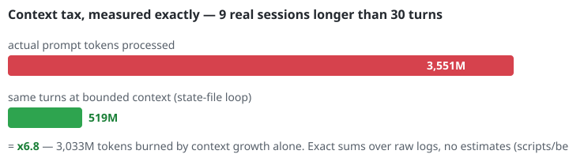
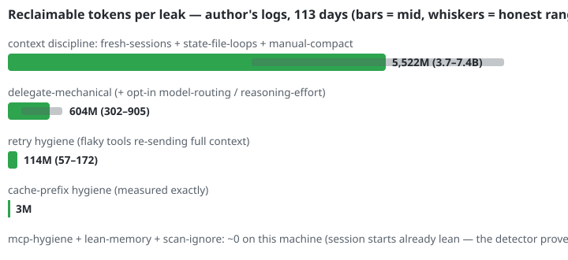

# codeunlimited

**Measure token waste, then run long coding work with bounded state instead of
an ever-growing orchestration transcript.**


`codeunlimited` has two product surfaces. Its local auditor separates what was
**observed** from what is **modeled**, sums local log counters exactly, and
measures input tokens per comparable completed task. Its 2.0 stateful runtime
executes long work as fresh provider processes connected by a bounded,
validated state. Neither surface promises a fixed savings percentage. A
historical selected-session snapshot reported an x6.8 observed/model ratio;
that number remains counterfactual exposure, not realized savings
([methodology](docs/BENCHMARK.md)).

You hit the weekly limit of Claude Code or Codex CLI mid-task. The limit is
fixed — but how much *work* fits inside it is not. `codeunlimited` reads the
session logs already on your machine, shows where limit tokens leak, and sets
your projects up so the same subscription produces more code.

> Not a usage tracker. For accounting ("how much did I use") see
> [ccusage](https://github.com/ryoppippi/ccusage). codeunlimited answers the
> next question: **why so much, and how to fit more work into the same limit.**

## What it finds

- **Context tax of long sessions** — by turn 40 every reply drags the whole
  history through the context window; observed multiplier per session.
- **Heavy model on mechanical replies** — top-tier requests that ended in a
  3-line answer; delegable to a light model.
- **Mid-session cache re-writes** — broken prompt prefixes that re-pay for
  context instead of reading it back. Normal TTL expiry is shown separately
  and excluded from reclaimable totals.
- **Fat session starts** — unused MCP servers whose schemas are paid on every
  new session.
- **Retry storms** — the same request re-sent in bursts (flaky tools, silent
  auto-retries), each attempt dragging the full context.

Plus a **limit forecast**: Codex logs expose `used_percent`, so the tool
calibrates your window's capacity from your own data and estimates how many
hours remain at the observed pace. It does not attribute that forecast to a fix.

Each finding is reported in **limit currency**: estimated reclaimable tokens,
share of weekly volume, and an estimated number of extra agent answers.

## The techniques — no black box

Every rule the tool installs is a named, individually toggleable technique.
Each states its evidence level: some map directly to detectors, while others
are workflow policies that must be evaluated with a comparable-task
experiment. Run `codeunlimited audit` for local findings and
`python scripts/bench_context.py --json` for the explicit context model. The
[current evidence verdict](docs/EVIDENCE-VERDICT.md) separates the promising
three-policy case study from a causal or universal savings claim.





The second graphic shows estimation parameters, not achieved savings. Context
excess uses a 40–80% range (60% midpoint); top-tier short replies, fat starts,
and retry storms use 25–75% (50% midpoint). Confirmed in-TTL cache rewrites use
the observed duplicate amount without an assumption range.

| Technique | Prevents | Evidence | Default |
|---|---|---|---|
| `fresh-sessions` | dragging dead history through every turn | modeled exposure; three-policy case study supports context-aware batching, not a universal threshold | on |
| `state-file-loops` | re-reading conversation in long loops | workflow policy; measure per completed task | on |
| `manual-compact` | passive autocompact of stale threads | workflow policy; measure per completed task | on |
| `delegate-mechanical` | top-tier model on renames/boilerplate | audit estimate w/ range | on, guardrailed |
| `no-rereads` | re-reading files already in context | part of context tax | on |
| `file-refs` | pasted file bodies living in context forever | part of context tax | on |
| `concise-answers` | output tokens spent on narration | rule-only | on |
| `mcp-hygiene` | unused MCP schemas billed at every session start | audit estimate w/ range (fat-start detector) | on |
| `lean-memory` | oversized CLAUDE.md/AGENTS.md billed every turn | measured (fix check) | on |
| `scan-ignore` | searches burning tokens in dumps/build output | rule-only | on |
| `tool-output-budget` | verbose Codex command output | rule-only (config hint) | on |
| `reasoning-effort` | thinking tokens on routine work | **opt-in** — can affect quality | off |
| `model-routing` | top-tier sessions for routine tasks | **opt-in** — can affect quality | off |

Toggle any of them (`.codeunlimited.toml`):

```toml
[techniques]
disable = ["delegate-mechanical"]
enable  = ["reasoning-effort"]
```

`codeunlimited techniques` lists the catalog with live status;
`codeunlimited init` re-renders the blocks after toggling and upgrades old
block versions in place (backup kept). Quality guardrail: techniques that
could trade output quality for tokens are marked, phrased with explicit
limits, and the aggressive ones default to off — built for smart,
token-hungry next-gen models.

## Stateful runtime (2.0)

For work that spans many agent increments, `codeunlimited run` holds only an
immutable workflow, the current structured state, and the latest observation
at each orchestration boundary. It never inserts earlier orchestration prompts,
reasoning, responses, or tool transcripts into the next prompt, and it starts a
fresh Claude Code, Codex, or explicit command process for every step.

```bash
codeunlimited run init sprint-2 --skill workflow.md \
  --objective "Implement and verify the next planned increment" \
  --provider codex --verify-program cargo --verify-arg test
codeunlimited run status sprint-2 --json
codeunlimited run prompt sprint-2
codeunlimited run step sprint-2 --json
codeunlimited run auto sprint-2 --steps 4 --json
```

State, prompt, observation, output, timeout, and attempt budgets are hard
limits. Structured transitions are revision-checked; terminal completion can
require an external verification command; ambiguous repository mutations stop
for explicit recovery instead of being retried blindly. See the complete
[runtime contract, storage layout, caching semantics, and recovery guide](docs/RUNTIME.md).

This proves bounded context transport at orchestration-step boundaries, not at
every tool action inside the provider and not yet as realized token savings.
The next evidence milestone is a matched-quality, increasing-horizon comparison
against a full-history agent.

## Install (one command)

macOS / Linux:

```bash
curl -fsSL https://raw.githubusercontent.com/jimbokl/codeunlimited/main/install.sh | sh
```

Windows (PowerShell):

```powershell
irm https://raw.githubusercontent.com/jimbokl/codeunlimited/main/install.ps1 | iex
```

Both require the release's sha256 before replacing an installed binary.
PowerShell adds the verified directory to user PATH idempotently; the Unix
installer uses `~/.local/bin` and prints the exact export when that directory
is not already on PATH. Alternatives: `cargo install codeunlimited --locked`
or a binary straight from GitHub Releases.

## Quick start

The core is a single **Rust** binary designed for multi-gigabyte local histories,
with no runtime dependencies. Benchmark it on your own logs:

```bash

codeunlimited audit               # offline scan of ~/.claude and ~/.codex logs
codeunlimited init myproject/     # efficiency rules into CLAUDE.md + AGENTS.md
codeunlimited audit --project .   # report scoped to one project
codeunlimited delta myproject/    # before/after tracking since init's baseline
codeunlimited experiment start sprint-a myproject/  # begin an observed-counter ledger
codeunlimited experiment finish sprint-a --tasks 3 myproject/ --json
codeunlimited experiment compare control treatment myproject/ --json
codeunlimited report myproject/   # saved report (MD + styled HTML): findings + delta + trend
codeunlimited report --all        # one summary across every project you've touched
codeunlimited fix myproject/      # findings -> concrete changes (dry-run; --apply)
codeunlimited fix --all --apply   # same, across every project you've touched
codeunlimited doctor              # parsers still understand your log formats?
codeunlimited compare             # last 7 days vs the 7 before
codeunlimited schedule            # installs on Windows; prints a cron line elsewhere
codeunlimited skill               # /codeunlimited inside Claude Code sessions
codeunlimited run --help           # bounded stateful orchestration (may invoke a provider)
```

Thresholds and ignored projects are tunable via `.codeunlimited.toml`.
Machine-wide settings come from `~/.codeunlimited/config.toml`; an explicitly
selected project's file is layered on top. See the header of
[src/config.rs](src/config.rs) for the format.

`report` extras: `--badge` writes an SVG "estimated opportunity" badge for your
README; `--anonymize` hashes project names so reports can be shared publicly.

`experiment` stores exact observed integer token counters for explicit
half-open windows (`start <= request timestamp < finish`) and compares input
tokens per declared completed task. The comparison is observational: it does
not prove savings, and either arm with fewer than three tasks is labeled low
confidence. Historical windows can be backfilled with `experiment record`;
their RFC 3339 boundaries must use whole-second precision. Run
`codeunlimited experiment --help` for the complete command set.

The shipped CLI is the Rust binary. A legacy Python reference lives in
`codeunlimited/` for detector prototyping; it is not feature-equivalent and
uses a non-conflicting command:
`pip install -e . && codeunlimited-reference audit`.

## Two ways to adopt — both first-class

**Starting a new project:** run `codeunlimited init` in the fresh directory.
Token-efficiency rules (context-aware session boundaries, state-file pattern
for long loops per
[SKILL.state, arXiv 2608.26263](https://arxiv.org/abs/2608.26263),
light-model delegation, MCP hygiene) are in place from day one and picked up by
Claude Code and Codex automatically.

**Attaching to an existing project:** the same `codeunlimited init` appends
the rules to your existing CLAUDE.md/AGENTS.md (idempotent, marker-guarded,
with a backup before replacement). Ambiguous or malformed marker layouts are
rejected without changing the instruction file. For a valid block, the command
also uses existing history to print an immediate baseline: requests, sessions,
and the top limit leak found in *this* project.
Then `codeunlimited audit --project <path>` gives the full scoped report,
and re-running it later shows your delta.

## Reports you can keep and share

`codeunlimited report <project>` writes two files into the project:
`CODEUNLIMITED_REPORT.md` and a styled, self-contained
`CODEUNLIMITED_REPORT.html` (light/dark, zero external requests — safe to
open, mail, or screenshot). Both show current leaks in limit currency, the
before/after delta since `init` captured the baseline, and a trend with one row
per run (snapshots accumulate in `.codeunlimited.history.jsonl`).

`codeunlimited report --all` produces one summary pair across every project
`init`/`fix`/`report` has touched: global usage, top projects, a per-project
delta table, and a global trend. Re-run it weekly — the trend records whether
the observed metrics moved after adoption.

Every estimate is deliberately conservative and documented in
[docs/ACCURACY.md](docs/ACCURACY.md) — ranges from your own logs, not
marketing multipliers.

For reproducible scanner measurements and a separate real-work outcome
protocol, see [docs/BENCHMARKING.md](docs/BENCHMARKING.md).

## Privacy

The **observation plane** has no network client. It extracts token counts,
model names, timestamps and project identifiers from local logs; prompt and
response text is not extracted, retained, printed, or transmitted.

The **execution plane** is explicitly different: `run step` and `run auto`
launch the configured provider process in the project. That provider may read
or change files and may use the network and existing authentication. The exact
boundary and all files written under `.codeunlimited/runs/` are documented in
[SECURITY.md](SECURITY.md) and [docs/RUNTIME.md](docs/RUNTIME.md).

## Supported sources

| Tool | Location | Status |
|---|---|---|
| Claude Code | `~/.claude/projects/**/*.jsonl` | ✅ |
| Codex CLI | `~/.codex/sessions/**/*.jsonl` | ✅ |
| Gemini CLI | — | planned |

MIT license.
