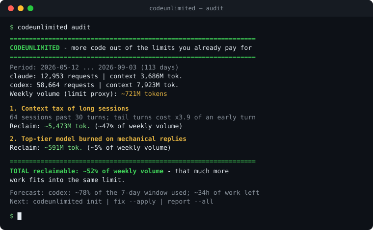

# codeunlimited

**Set up once — more work from the same subscription limits.**



The core number is exact, not an estimate: in the author's own logs
(71k requests, 113 days) the 9 longest sessions processed **3,551M prompt
tokens where a bounded-context loop pays 519M — x6.8**, three billion tokens
burned by context growth alone ([docs/BENCHMARK.md](docs/BENCHMARK.md),
reproduce with `scripts/bench_context.py`). On top of that the audit
estimates ~52% of weekly volume as reclaimable opportunity — estimates are
conservative and documented in [docs/ACCURACY.md](docs/ACCURACY.md).

You hit the weekly limit of Claude Code or Codex CLI mid-task. The limit is
fixed — but how much *work* fits inside it is not. `codeunlimited` reads the
session logs already on your machine, shows where limit tokens leak, and sets
your projects up so the same subscription produces more code.

> Not a usage tracker. For accounting ("how much did I use") see
> [ccusage](https://github.com/ryoppippi/ccusage). codeunlimited answers the
> next question: **why so much, and how to fit more work into the same limit.**

## What it finds

- **Context tax of long sessions** — by turn 40 every reply drags the whole
  history through the context window; observed multiplier per session.
- **Heavy model on mechanical replies** — top-tier requests that ended in a
  3-line answer; delegable to a light model.
- **Mid-session cache re-writes** — broken prompt prefixes that re-pay for
  context instead of reading it back. Normal TTL expiry is shown separately
  and excluded from reclaimable totals.
- **Fat session starts** — unused MCP servers whose schemas are paid on every
  new session.
- **Retry storms** — the same request re-sent in bursts (flaky tools, silent
  auto-retries), each attempt dragging the full context.

Plus a **limit forecast**: Codex logs expose `used_percent`, so the tool
calibrates your window's capacity from your own data and answers "how many
hours of work are left before the wall - and how much a fix moves it".

Each finding is reported in **limit currency**: tokens reclaimed, % of your
weekly volume, extra agent answers that fit into the same limit.

## Install (one command)

macOS / Linux:

```bash
curl -fsSL https://raw.githubusercontent.com/jimbokl/codeunlimited/main/install.sh | sh
```

Windows (PowerShell):

```powershell
irm https://raw.githubusercontent.com/jimbokl/codeunlimited/main/install.ps1 | iex
```

Both fetch the latest release binary for your platform, verify its sha256,
and put it on PATH. Alternatives: `cargo install codeunlimited --locked` or
a binary straight from GitHub Releases.

## Quick start

The core is a single **Rust** binary designed for multi-gigabyte local histories,
with no runtime dependencies. Benchmark it on your own logs:

```bash

codeunlimited audit               # offline scan of ~/.claude and ~/.codex logs
codeunlimited init myproject/     # efficiency rules into CLAUDE.md + AGENTS.md
codeunlimited audit --project .   # report scoped to one project
codeunlimited delta myproject/    # before/after tracking since init's baseline
codeunlimited experiment start sprint-a myproject/  # begin an exact bounded ledger
codeunlimited experiment finish sprint-a --tasks 3 myproject/ --json
codeunlimited experiment compare control treatment myproject/ --json
codeunlimited report myproject/   # saved report (MD + styled HTML): findings + delta + trend
codeunlimited report --all        # one summary across every project you've touched
codeunlimited fix myproject/      # findings -> concrete changes (dry-run; --apply)
codeunlimited fix --all --apply   # same, across every project you've touched
codeunlimited doctor              # parsers still understand your log formats?
codeunlimited compare             # last 7 days vs the 7 before
codeunlimited schedule            # installs on Windows; prints a cron line elsewhere
codeunlimited skill               # /codeunlimited inside Claude Code sessions
```

Thresholds and ignored projects are tunable via `.codeunlimited.toml`.
Machine-wide settings come from `~/.codeunlimited/config.toml`; an explicitly
selected project's file is layered on top. See the header of
[src/config.rs](src/config.rs) for the format.

`report` extras: `--badge` writes an SVG "reclaimable %" badge for your
README; `--anonymize` hashes project names so reports can be shared publicly.

`experiment` stores exact observed integer token counters for explicit
half-open windows (`start <= request timestamp < finish`) and compares input
tokens per declared completed task. The comparison is observational: it does
not prove savings, and either arm with fewer than three tasks is labeled low
confidence. Historical windows can be backfilled with `experiment record`;
their RFC 3339 boundaries must use whole-second precision. Run
`codeunlimited experiment --help` for the complete command set.

The shipped CLI is the Rust binary. A legacy Python reference lives in
`codeunlimited/` for detector prototyping; it is not feature-equivalent and
uses a non-conflicting command:
`pip install -e . && codeunlimited-reference audit`.

## Two ways to adopt — both first-class

**Starting a new project:** run `codeunlimited init` in the fresh directory.
Token-efficiency rules (fresh-session discipline, state-file pattern for long
loops per [SKILL.state, arXiv 2608.26263](https://arxiv.org/abs/2608.26263),
light-model delegation, MCP hygiene) are in place from day one and picked up
by Claude Code and Codex automatically.

**Attaching to an existing project:** the same `codeunlimited init` appends
the rules to your existing CLAUDE.md/AGENTS.md (idempotent, marker-guarded,
with a backup before replacement)
and — because the project already has history — instantly prints its
baseline: requests, sessions, and the top limit leak found in *this* project.
Then `codeunlimited audit --project <path>` gives the full scoped report,
and re-running it later shows your delta.

## Reports you can keep and share

`codeunlimited report <project>` writes two files into the project:
`CODEUNLIMITED_REPORT.md` and a styled, self-contained
`CODEUNLIMITED_REPORT.html` (light/dark, zero external requests — safe to
open, mail, or screenshot). Both show current leaks in limit currency, the
before/after delta since `init` captured the baseline, and a trend with one row
per run (snapshots accumulate in `.codeunlimited.history.jsonl`).

`codeunlimited report --all` produces one summary pair across every project
`init`/`fix`/`report` has touched: global usage, top projects, a per-project
delta table, and a global trend. Re-run it weekly — the trend records whether
the observed metrics moved after adoption.

Every estimate is deliberately conservative and documented in
[docs/ACCURACY.md](docs/ACCURACY.md) — ranges from your own logs, not
marketing multipliers.

For reproducible scanner measurements and a separate real-work outcome
protocol, see [docs/BENCHMARKING.md](docs/BENCHMARKING.md).

## Privacy

The runtime has no network client. It extracts token counts, model names,
timestamps and project identifiers from local logs. Prompt and response text
is not extracted, retained, printed, or transmitted. The files written by
`init`, `fix`, `report`, `experiment`, `skill`, and `schedule` are listed in
[SECURITY.md](SECURITY.md).

## Supported sources

| Tool | Location | Status |
|---|---|---|
| Claude Code | `~/.claude/projects/**/*.jsonl` | ✅ |
| Codex CLI | `~/.codex/sessions/**/*.jsonl` | ✅ |
| Gemini CLI | — | planned |

MIT license.
